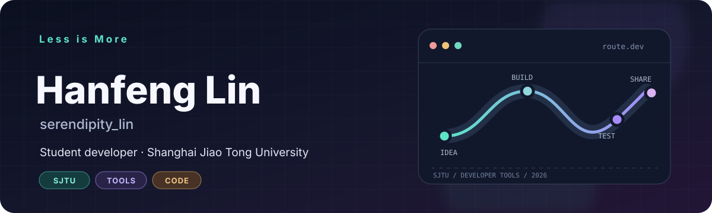
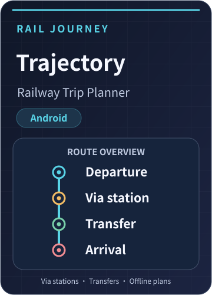
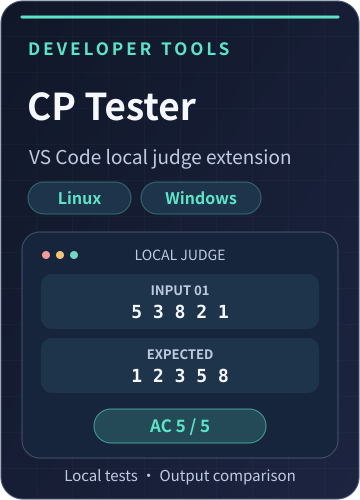
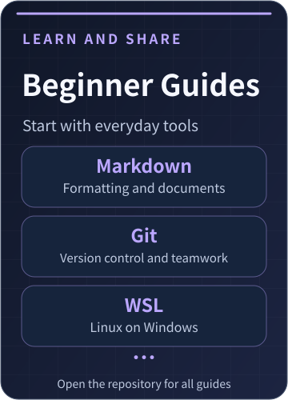

<a href="./README.md">简体中文</a> · <strong>English</strong>

  <picture>
    <source media="(prefers-color-scheme: light)" srcset="./assets/hero-en-light.svg" />
    
  </picture>

  <a href="https://readme-typing-svg.demolab.com">
    <picture>
      <source media="(prefers-color-scheme: light)" srcset="https://readme-typing-svg.demolab.com?font=Fira+Code&amp;size=20&amp;duration=2800&amp;pause=900&amp;color=167C74&amp;center=true&amp;vCenter=true&amp;width=700&amp;lines=Student+%40+SJTU+Zhiyuan+College;Building+plugins+and+useful+software;Explore+%E2%86%92+Build+%E2%86%92+Share" />
      
    </picture>
  </a>

  
  

  <picture>
    <source media="(prefers-color-scheme: light)" srcset="./assets/divider-light.svg" />
    
  </picture>

## 👋 About me

I'm **Hanfeng Lin** (born July 31, 2007), a Computer Science and Technology student in the **JOHN Class** at **Zhiyuan College, Shanghai Jiao Tong University**.

I enjoy turning problems from studying and everyday life into useful tools. My projects include a railway trip planner, a VS Code local judging extension, and course materials. I also work on teaching and school administration software designed for practical use in schools.

I'm interested in thought puzzles, mathematics, and programming problems. I often explore them on my own and would love to share ideas and discuss them with others!

### 🎓 Education and competition awards

<picture>
  <source media="(prefers-color-scheme: light)" srcset="./assets/timeline-medals-subtle-en-light.svg" />
  
</picture>

  <picture>
    <source media="(prefers-color-scheme: light)" srcset="./assets/divider-light.svg" />
    
  </picture>

## 🧩 My projects

### 🚀 Completed projects

> I may still release occasional bug fixes and improvements.

  <picture>
    <source media="(prefers-color-scheme: light)" srcset="./assets/projects/rail-cover-en-light.svg" />
    
  </picture>
  <picture>
    <source media="(prefers-color-scheme: light)" srcset="./assets/projects/cp-tester-cover-en-light.svg" />
    
  </picture>
  <picture>
    <source media="(prefers-color-scheme: light)" srcset="./assets/projects/guides-cover-en-light.svg" />
    
  </picture>

| Project | Description |
| --- | --- |
| 🚄 [Trajectory · Railway Trip Planner](https://github.com/serendipitylin0731/ticket_planner_realease) | An Android railway trip planning tool I developed independently, with via-station and transfer filters plus online or static timetable planning. |
| 🧪 **CP Tester · VS Code local judge extension** · [Linux](https://github.com/serendipitylin0731/CP_Tester_Linux) / [Windows](https://github.com/serendipitylin0731/CP_Tester_Windows) | A local judging extension I developed independently for testing C, C++, and Python programs and comparing their output (Nailong approves, just kidding). |
| 📚 [Beginner Computing Guides](https://github.com/serendipitylin0731/Instuction) | Introductory guides I wrote on Markdown, Git, WSL, and other tools. The original guides are available in the repository. |

### 🏫 Current projects

- Serving as a teaching assistant for [Programming and Data Structures in the 2026 JOHN Class](https://github.com/SJTUJohnClass) at Zhiyuan College. I'm responsible for [Gitlite, a lightweight Git learning project](https://github.com/serendipitylin0731/gitlite_2026_stu), and teach search algorithms.
- Developing and customizing templates for an academic scheduling system. This project is not yet open source; feel free to email me about it.
- Developing a [teacher attendance and salary statistics program](https://github.com/serendipitylin0731/Salary_Computing) to help Taizhou Sunson Middle School organize administrative records.
- Developing [a knowledge assistant and strategic analysis platform for Fuzhou's "3820" initiative](https://github.com/serendipitylin0731/3820_agent) as an individual project for the Introduction to Xi Jinping Thought on Socialism with Chinese Characteristics for a New Era course, exploring source-traceable multi-agent Q&A and analysis.

### 🛠️ Languages and tools

  <picture>
    <source media="(prefers-color-scheme: light)" srcset="https://skillicons.dev/icons?i=c%2Ccpp%2Cpy%2Cjs%2Cbash%2Chtml%2Ccss%2Cmd%2Clatex%2Cvscode%2Cpycharm%2Cgit%2Ccmake%2Clinux%2Cnodejs%2Csqlite&amp;theme=light&amp;perline=8" />
    
  </picture>

<strong>Programming and web</strong> · C · C++ · Python · JavaScript · Bash/Shell · HTML/CSS <strong>Development environment</strong> · VS Code · PyCharm · Node.js · WSL · Git · CMake · GCC <strong>Data and diagrams</strong> · Jupyter · SQLite · Origin · LabVIEW · GeoGebra · Mermaid <strong>Documentation</strong> · Markdown · LaTeX

  <picture>
    <source media="(prefers-color-scheme: light)" srcset="./assets/divider-light.svg" />
    
  </picture>

## 🎮 Beyond code

<table width="100%">
  <tr>
    <td width="64" align="center">🎮</td>
    <td><strong>Games:</strong> QQ Speed (UID: <code>44758614</code>, <a href="https://www.douyin.com/user/MS4wLjABAAAA5cQxzhgNTyrF6Nzu1o-rQjxXcQnFDkVfGVZofKXqukvKc4JqRauw4z-jXmtkR6JV">Yunxi team</a>), Peacekeeper Elite, Arknights</td>
  </tr>
</table>

<table width="100%">
  <tr>
    <td width="64" align="center">♟️</td>
    <td><strong>Arts and entertainments:</strong> Chinese chess, international chess, Gomoku, calligraphy, drums, and fuse beads</td>
  </tr>
</table>

<table width="100%">
  <tr>
    <td width="64" align="center">⚽</td>
    <td><strong>Sports:</strong> Football (goalkeeper), badminton, pickleball, table tennis, and cycling</td>
  </tr>
</table>

  <picture>
    <source media="(prefers-color-scheme: light)" srcset="./assets/divider-light.svg" />
    
  </picture>

## 📬 Get in touch

Have a project idea, want to discuss a course, or interested in collaborating? Email me at **[serendipity_lin@sjtu.edu.cn](mailto:serendipity_lin@sjtu.edu.cn)**. You can also browse my current work in my [GitHub repositories](https://github.com/serendipitylin0731?tab=repositories).

  <picture>
    <source media="(prefers-color-scheme: light)" srcset="./assets/endline-light.svg" />
    
  </picture>

