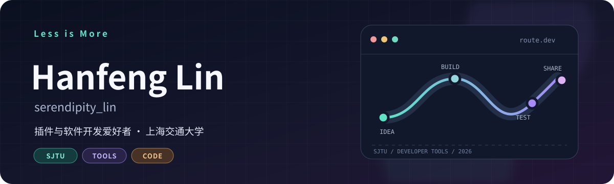
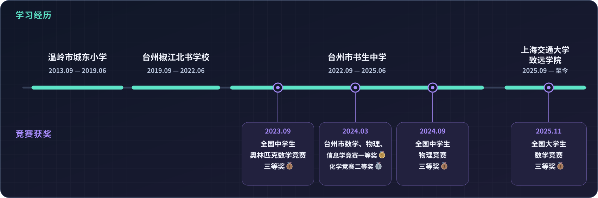
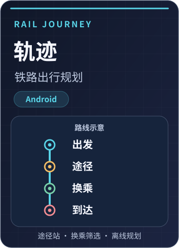
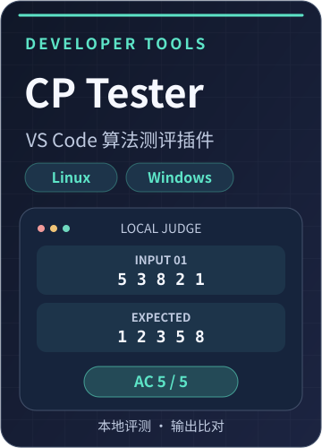
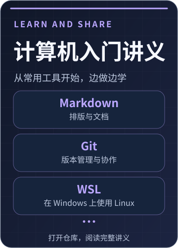

<strong>简体中文</strong> · <a href="./README-En.md">English</a>

  <picture>
    <source media="(prefers-color-scheme: light)" srcset="./assets/hero-light.svg" />
    
  </picture>

  <a href="https://readme-typing-svg.demolab.com">
    <picture>
      <source media="(prefers-color-scheme: light)" srcset="https://readme-typing-svg.demolab.com?font=Fira+Code&amp;size=20&amp;duration=2800&amp;pause=900&amp;color=167C74&amp;center=true&amp;vCenter=true&amp;width=700&amp;lines=Student+%40+SJTU+Zhiyuan+College;Building+plugins+and+useful+software;Explore+%E2%86%92+Build+%E2%86%92+Share" />
      
    </picture>
  </a>

  
  

  <picture>
    <source media="(prefers-color-scheme: light)" srcset="./assets/divider-light.svg" />
    
  </picture>

## 👋 关于我

我是**林函锋**（2007.07.31），上海交通大学 致远学院 计算机科学与技术 **JOHN 班** 学生

喜欢把学习和生活里的具体问题做成工具：铁路出行规划、VS Code 本地测评插件、课程学习资料等都是我在做的项目，也参与教学与教务软件开发，可以实际落地在学校中使用

平时对于有趣的思维问题，数学或编程问题比较感兴趣，会自行研究，欢迎一起分享探讨！

### 🎓 学习经历与竞赛获奖

<picture>
  <source media="(prefers-color-scheme: light)" srcset="./assets/timeline-medals-subtle-light.svg" />
  
</picture>

  <picture>
    <source media="(prefers-color-scheme: light)" srcset="./assets/divider-light.svg" />
    
  </picture>

## 🧩 我的项目

### 🚀 已结项

> 可能会有不定期的 debug 或 improve 更新

  <picture>
    <source media="(prefers-color-scheme: light)" srcset="./assets/projects/rail-cover-light.svg" />
    
  </picture>
  <picture>
    <source media="(prefers-color-scheme: light)" srcset="./assets/projects/cp-tester-cover-light.svg" />
    
  </picture>
  <picture>
    <source media="(prefers-color-scheme: light)" srcset="./assets/projects/guides-cover-light.svg" />
    
  </picture>

| 项目 | 简介 |
| --- | --- |
| 🚄 [轨迹 · 铁路出行规划](https://github.com/serendipitylin0731/ticket_planner_realease) | 独立开发的 Android 铁路出行规划工具；支持途径站、换乘筛选，以及联网或静态时刻表规划 |
| 🧪 **CP Tester · VS Code 算法测评插件** · [Linux](https://github.com/serendipitylin0731/CP_Tester_Linux) / [Windows](https://github.com/serendipitylin0731/CP_Tester_Windows) | 独立开发的本地测评插件，支持 C、C++、Python 程序的测试与输出比对（奶龙狂喜 bushi） |
| 📚 [计算机入门讲义](https://github.com/serendipitylin0731/Instuction) | 独立编写的零基础工具指南，涵盖 Markdown、Git、WSL 等主题；打开仓库即可阅读原文 |

### 🏫 近期项目

- 担任 **2026 级致远学院 [JOHN 班程序设计与数据结构](https://github.com/SJTUJohnClass)助教**，负责 [Gitlite：轻量级 Git 学习项目](https://github.com/serendipitylin0731/gitlite_2026_stu)，并讲解搜索算法
- 开发和定制教务排课系统模板；项目暂未开源，欢迎通过邮件交流
- 开发 [教师出勤与工资统计程序](https://github.com/serendipitylin0731/Salary_Computing)，协助书生中学整理教务统计工作

### 🛠️ 技术与工具

  <picture>
    <source media="(prefers-color-scheme: light)" srcset="https://skillicons.dev/icons?i=c%2Ccpp%2Cpy%2Cjs%2Cbash%2Chtml%2Ccss%2Cmd%2Clatex%2Cvscode%2Cpycharm%2Cgit%2Ccmake%2Clinux%2Cnodejs%2Csqlite&amp;theme=light&amp;perline=8" />
    
  </picture>

<strong>编程语言与网页</strong> · C · C++ · Python · JavaScript · Bash/Shell · HTML/CSS <strong>开发环境</strong> · VS Code · PyCharm · Node.js · WSL · Git · CMake · GCC <strong>数据与图示</strong> · Jupyter · SQLite · Origin · LabVIEW · GeoGebra · Mermaid <strong>文档</strong> · Markdown · LaTeX

  <picture>
    <source media="(prefers-color-scheme: light)" srcset="./assets/divider-light.svg" />
    
  </picture>

## 🎮 代码之外

<table width="100%">
  <tr>
    <td width="64" align="center">🎮</td>
    <td><strong>游戏：</strong> QQ 飞车（UID: <code>44758614</code>, <a href="https://www.douyin.com/user/MS4wLjABAAAA5cQxzhgNTyrF6Nzu1o-rQjxXcQnFDkVfGVZofKXqukvKc4JqRauw4z-jXmtkR6JV">车队 · 云曦</a>）、和平精英、明日方舟</td>
  </tr>
</table>

<table width="100%">
  <tr>
    <td width="64" align="center">♟️</td>
    <td><strong>文艺：</strong> 中国象棋、国际象棋、五子棋、书法；架子鼓；拼豆</td>
  </tr>
</table>

<table width="100%">
  <tr>
    <td width="64" align="center">⚽</td>
    <td><strong>运动：</strong> 足球 (守门员) 、羽毛球、匹克球、乒乓球、自行车</td>
  </tr>
</table>

  <picture>
    <source media="(prefers-color-scheme: light)" srcset="./assets/divider-light.svg" />
    
  </picture>

## 📬 联系我

有项目想法、课程交流或合作建议，欢迎写信到 **[serendipity_lin@sjtu.edu.cn](mailto:serendipity_lin@sjtu.edu.cn)**。也可以从 [GitHub 仓库](https://github.com/serendipitylin0731?tab=repositories) 找到我正在做的项目

  <picture>
    <source media="(prefers-color-scheme: light)" srcset="./assets/endline-light.svg" />
    
  </picture>

